# Complete Project Agent Orchestration Workflow

## Mermaid Diagram

```mermaid
flowchart TD
    A[👤 User Input] --> B[🔍 Input Analysis]
    B --> C{🛡️ Input Guardrails Pass?}
    C --> |❌ Blocked| D[🚫 Guardrails Response]
    C --> |✅ Pass| E{🖼️ Has Image?}
    
    E --> |Yes| F[🤖 GPT-4 Vision Classification]
    E --> |No| G[🧠 LLM Decision Chain]
    
    F --> H{🏥 Medical Image Type?}
    H --> |BRAIN MRI| I[🧠 Brain Tumor Agent]
    H --> |CHEST X-RAY| J[🫁 Chest X-ray Agent] 
    H --> |SKIN LESION| K[🩸 Skin Lesion Agent]
    H --> |NON-MEDICAL| L[💬 Conversation Agent]
    
    G --> M{🎯 Query Type?}
    M --> |General Chat| L
    M --> |Medical Knowledge| N[📚 RAG Agent]
    M --> |Current Info| O[🌐 Web Search Agent]
    
    N --> P{📊 RAG Confidence?}
    P --> |High| Q[✅ RAG Response]
    P --> |Low| O
    
    I --> R[⚠️ Human Validation]
    J --> R
    K --> R
    L --> S[🛡️ Output Guardrails]
    O --> S
    Q --> S
    
    R --> T[🏥 Medical Review]
    T --> S
    S --> U[📤 Final Response]
    D --> V[🏁 End]
    U --> V

    style A fill:#e1f5fe
    style B fill:#f3e5f5
    style F fill:#fff3e0
    style G fill:#e8f5e8
    style I fill:#ffebee
    style J fill:#e8f5e8
    style K fill:#fff3e0
    style L fill:#f9fbe7
    style N fill:#e3f2fd
    style O fill:#fff8e1
    style R fill:#fce4ec
    style S fill:#f1f8e9
    style U fill:#e8f5e8
```

## Workflow Description

### Input Processing
1. **Input Analysis**: System analyzes user input for content and media
2. **Input Guardrails**: Safety checks to filter inappropriate content
3. **Input Classification**: Determines if input contains images or is text-only

### Routing Logic
4. **Direct Medical Image Routing**: 
   - Medical images bypass expensive LLM routing
   - Direct to specialized PyTorch models for privacy and speed
5. **Text Query Routing**: LLM decides between conversation, RAG, or web search

### Agent Execution
6. **Specialized Processing**:
   - **Medical Agents**: Local model inference with visualization
   - **RAG Agent**: Knowledge retrieval with confidence scoring
   - **Web Search Agent**: Real-time information retrieval
   - **Conversation Agent**: General medical conversation

### Quality Assurance
7. **Confidence-Based Handoff**: Low RAG confidence triggers web search
8. **Human Validation**: All medical diagnoses require expert review
9. **Output Guardrails**: Final safety and quality checks
10. **Response Delivery**: Structured response with sources and validation status