# Image Analysis Agent Workflow

## Mermaid Diagram

```mermaid
flowchart TD
    A[🖼️ Image Upload] --> B[🤖 GPT-4 Vision Classification]
    B --> C{🩺 Medical Image Type?}
    C --> |BRAIN MRI| D[🧠 Brain Tumor Agent]
    C --> |CHEST X-RAY| E[🫁 Chest X-ray Agent]
    C --> |SKIN LESION| F[🩸 Skin Lesion Agent]
    C --> |NON-MEDICAL/OTHER| G[💬 Conversation Agent]
    
    D --> D1[⚡ YOLO Model Inference]
    D1 --> D2[🎨 Bounding Box Visualization]
    D2 --> D3[📊 Tumor Detection Result]
    
    E --> E1[⚡ DenseNet Model Inference]
    E1 --> E2[📈 COVID-19 Classification]
    
    F --> F1[⚡ U-Net Model Inference]
    F1 --> F2[🎨 Segmentation Mask Generation]
    F2 --> F3[📐 Lesion Area Analysis]
    
    D3 --> H[⚠️ Human Validation Required]
    E2 --> H
    F3 --> H
    G --> I[💬 General Response]
    
    H --> J[🏥 Medical Professional Review]
    J --> K[✅ Validated Medical Result]
    I --> L[🏁 End]
    K --> L

    style A fill:#e1f5fe
    style B fill:#f3e5f5
    style D fill:#ffebee
    style E fill:#e8f5e8
    style F fill:#fff3e0
    style G fill:#f9fbe7
    style H fill:#fce4ec
    style K fill:#e8f5e8
```

## Workflow Description

1. **Image Classification**: GPT-4 Vision analyzes uploaded image to determine medical type
2. **Direct Routing**: System routes to specialized local PyTorch models based on image type
3. **Local Model Processing**: 
   - **Brain MRI**: YOLO object detection for tumor identification
   - **Chest X-ray**: DenseNet classification for COVID-19 detection  
   - **Skin Lesion**: U-Net segmentation for lesion boundary detection
4. **Visualization Generation**: Creates annotated images with detection results
5. **Medical Validation**: All medical diagnoses flagged for human expert review
6. **Output**: Validated medical analysis with visual results