# RAG Agent Workflow

## Mermaid Diagram

```mermaid
flowchart TD
    A[📝 User Query Input] --> B[🔍 Query Expansion]
    B --> |LLM enhances with medical terms| C[📚 Vector Database Retrieval]
    C --> |Qdrant hybrid search| D[📄 Retrieved Documents]
    D --> E{📊 Documents Found?}
    E --> |Yes| F[🎯 Cross-Encoder Reranking]
    E --> |No| G[❌ No Results Found]
    F --> |Top-k relevant docs| H[🧠 Response Generation]
    H --> I[📋 Confidence Scoring]
    I --> J{🎚️ Confidence > Threshold?}
    J --> |High Confidence| K[✅ RAG Response with Sources]
    J --> |Low Confidence| L[🌐 Handoff to Web Search]
    G --> L
    K --> M[🏁 End]
    L --> M

    style A fill:#e1f5fe
    style B fill:#f3e5f5
    style C fill:#e8f5e8
    style F fill:#fff3e0
    style H fill:#fce4ec
    style K fill:#e8f5e8
    style L fill:#fff8e1
```

## Workflow Description

1. **Query Expansion**: LLM enhances user query with relevant medical terminology
2. **Vector Retrieval**: Qdrant performs hybrid BM25 + dense embedding search
3. **Reranking**: Cross-encoder model reorders results by relevance
4. **Response Generation**: LLM creates response using retrieved context
5. **Confidence Check**: System evaluates response quality for potential handoff
6. **Output**: High-confidence response with sources or handoff to web search